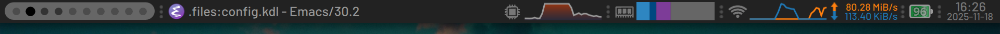

## Fancy bar

A more advanced variant of the [Simple bar](../simple-bar).

### Demo

https://github.com/user-attachments/assets/0d15347d-0c25-4f51-834e-02ac19055b43

### Features

- Multiple widgets:
  - Workspace indicator.
  - Focused window title with icon.
  - CPU: total usage line graph, with load average, individual core usage, and top processes in popup.
  - RAM: total usage segmented bar graph, with breakdown per usage type, and top processes in popup.
  - Network: up/down data rates in line graph and numerical form, with interface and network information in popup (SSID, signal strength, link speed, LAN and WAN IPs). Dynamic network type icon, showing WiFi signal strength. Supports switching interfaces via a right-click context menu.
  - Battery: icon with percentage and animated charging indicator, and charge/discharge rate and remaining time in popup. Supports vertical and horizontal orientations.
  - Stacked time and date.
- Supports top and bottom positioning.
- Relative scaling of most elements.
- Configurable via a [JSON file](./config.json). See [`Config.qml`](./modules/common/Config.qml) for possible configuration options.

### Dependencies

- CPU/RAM widgets:
  - `procps` package (`ps`, `uptime`)
  - `coreutils` package (`head`)
  - Read access to the `/proc` filesystem.

- Network widget: 
  - `findutils` package (`find`)
  - `iproute2` package (`ip`)
  - `iw` package (`iw`)
  - `bind-utils` package (`dig`)
  - Read access to the `/sys` filesystem.
  
- Battery widget: [UPower](https://upower.freedesktop.org/)

- Fonts: [Noto Sans](https://notofonts.github.io/)
